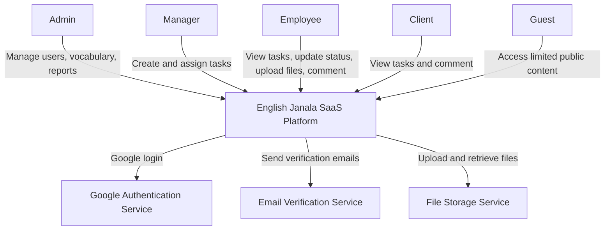
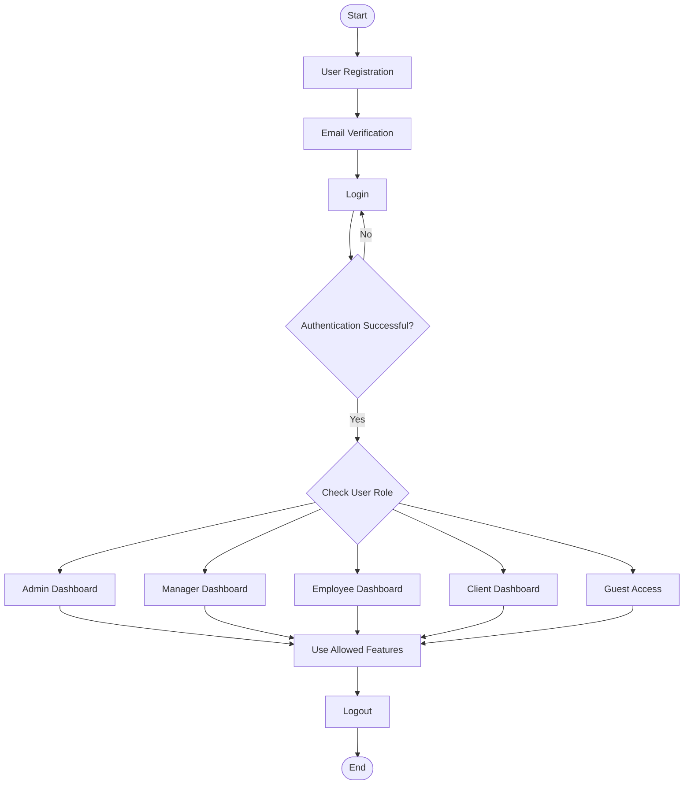
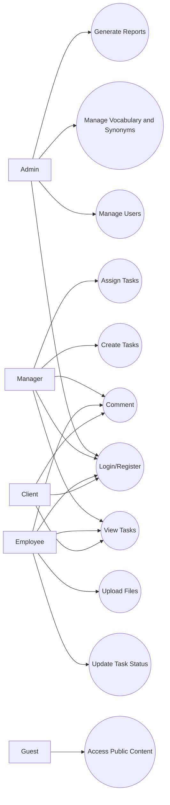
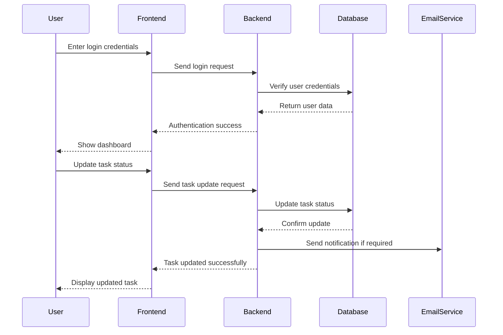
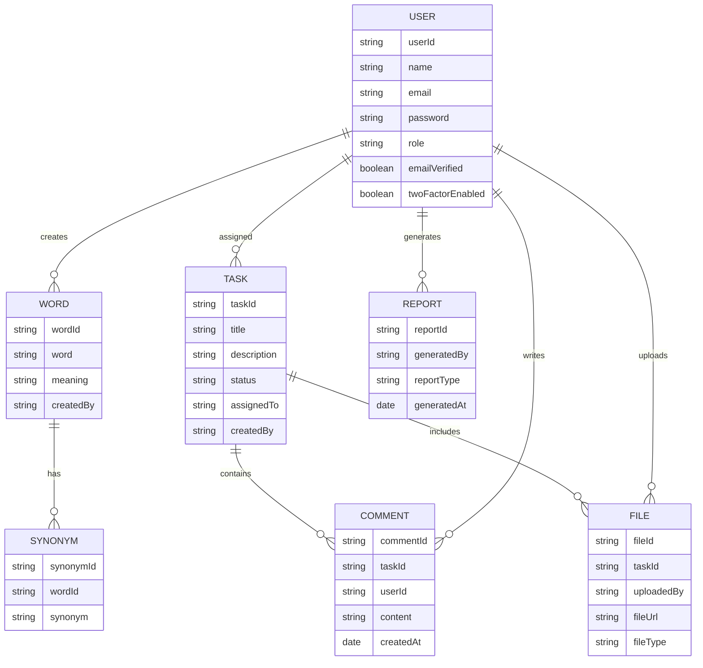
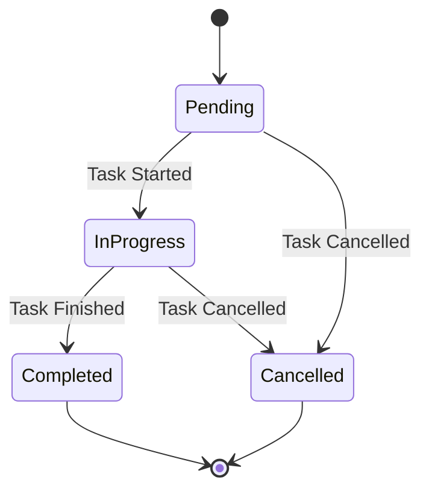

# Software Requirements Specification (SRS)

## Preface

This document provides the Software Requirements Specification (SRS) for **English Janala**. It defines the system’s functionalities, performance criteria, security requirements, user roles, and overall system architecture necessary for development.

English Janala is a web-based SaaS platform designed to help users learn English vocabulary and synonyms in a structured and accessible way. The system supports secure user registration, login, email verification, two-factor authentication, role-based access control, vocabulary management, task features, comments, file upload, and reporting.

---

## Version History

* **Version 1.0** – Initial Draft.
* **Version 1.1** – Added functional and non-functional requirements.
* **Version 1.2** – Refined system evolution, user roles, and glossary.

---

## 1. Introduction

### Purpose

The purpose of **English Janala** is to provide a web-based SaaS platform where users can learn English vocabulary and synonyms in an organized way. The system enables administrators to manage users, vocabulary content, reports, and platform settings. Other users can access learning materials, participate in assigned tasks, comment, upload files, and track their learning activities.

### Document Conventions

This document follows the IEEE SRS standard, using:

* **Must** – Indicates mandatory requirements.
* **Should** – Indicates recommended features.
* **May** – Indicates optional enhancements.

### Intended Audience and Reading Suggestions

* **Developers** – To understand system requirements before implementation.
* **Project Managers** – To monitor project scope and development progress.
* **Testers and QA Teams** – To validate system functionality and quality.
* **Administrators** – To understand user management and content control.
* **Stakeholders** – To understand the purpose and features of the platform.

### Scope

The system provides:

* User registration and login
* Google login and email-password authentication
* Email verification
* Two-factor authentication
* Role-based access control
* Vocabulary and synonym management
* Task management features
* Commenting system
* File upload support
* Reporting system
* Admin dashboard
* Web-based SaaS access

### References

* IEEE Standard 830-1998 Software Requirements Specification
* Internal Project Requirement Description
* SaaS Platform Design Guidelines
* Web Application Security Best Practices

---

## 2. Overall Description

### Product Perspective

**English Janala** is a standalone web-based SaaS application. It is designed for users who want to improve their English vocabulary and synonym knowledge. The platform will be accessible through modern web browsers and will support secure authentication, role-based access, and content management.

The system may later support mobile applications, AI-based recommendations, quizzes, progress tracking, and pronunciation support.

### Product Functions

* **User Authentication:** Users can register, log in, verify email, and use two-factor authentication.
* **Role-Based Access Control:** Different users will have different permissions based on their roles.
* **Vocabulary Management:** Admin users can add, update, and delete vocabulary words and synonyms.
* **Task Management:** Users can view tasks, update task status, comment, and upload files.
* **Comment System:** Users can communicate through comments related to tasks or learning activities.
* **File Upload:** Users can upload files related to assigned tasks.
* **Reporting:** Admin users can generate reports about users, tasks, and system activity.
* **Dashboard:** Users can view relevant information based on their role.

### User Classes and Characteristics

* **Admin:** Manages users, roles, vocabulary, synonyms, reports, and system settings.
* **Manager:** Manages tasks, monitors user progress, reviews comments, and supervises activities.
* **Employee:** Views assigned tasks, updates task status, uploads files, and comments.
* **Client:** Views assigned tasks and comments on relevant activities.
* **Guest:** Can access limited public features of the platform.

### Operating Environment

* Web-based application accessible through modern browsers.
* Supported browsers: Google Chrome, Mozilla Firefox, Microsoft Edge.
* Cloud-hosted infrastructure.
* Database: MongoDB.
* Frontend: Web application interface.
* Backend: Server-side API for authentication, vocabulary, task, comment, file, and report management.

### Design and Implementation Constraints

* The system must be developed as a web application.
* The system must support role-based access control.
* The system must provide secure authentication.
* The system must protect sensitive user data.
* The system should be scalable for SaaS-based usage.
* The system should follow modern UI/UX standards.
* The system must support future feature expansion.

### Assumptions and Dependencies

* Users must have internet access to use the platform.
* Users must provide a valid email address for registration.
* Google login depends on Google OAuth service availability.
* Email verification depends on an email delivery service.
* File upload depends on available storage service.
* Future AI features may depend on third-party AI APIs.

---

## 3. System Requirements Specification

## Functional Requirements

### User Authentication

* The system must allow users to register using email and password.
* The system must allow users to log in using email and password.
* The system must support Google login.
* The system must verify user email addresses.
* The system must support password reset functionality.
* The system must support two-factor authentication.
* The system must allow users to securely log out.

### Role-Based Access Control

* The system must support multiple user roles: Admin, Manager, Employee, Client, and Guest.
* The system must restrict access based on user role.
* Admin must be able to manage all users and roles.
* Managers must be able to manage tasks and monitor assigned users.
* Employees must only access assigned tasks and permitted features.
* Clients must only view assigned tasks and comment where permitted.
* Guests must only access limited public features.

### User Management

* Admin must be able to view all registered users.
* Admin must be able to update user roles.
* Admin must be able to activate or deactivate user accounts.
* Admin must be able to delete users when necessary.
* Admin must be able to monitor user activity.

### Vocabulary and Synonym Management

* Admin must be able to add new English words.
* Admin must be able to add synonyms for each word.
* Admin must be able to update existing words and synonyms.
* Admin must be able to delete words and synonyms.
* Users should be able to view vocabulary and synonym content.
* The system should organize vocabulary in a structured way.

### Task Management

* Managers must be able to create tasks.
* Managers must be able to assign tasks to employees or clients.
* Users must be able to view assigned tasks.
* Employees must be able to update task status.
* The system must support task status such as Pending, In Progress, Completed, and Cancelled.
* Managers must be able to monitor task progress.

### Comment System

* Users must be able to comment on assigned tasks.
* Managers must be able to review comments.
* Clients must be able to comment on permitted tasks.
* The system should display comments in chronological order.
* The system must store comment history.

### File Upload

* Users must be able to upload files related to tasks.
* The system must validate uploaded file type and size.
* The system must store uploaded files securely.
* Managers and Admins must be able to view uploaded files.
* The system should allow users to download permitted files.

### Reporting System

* Admin must be able to generate user reports.
* Admin must be able to generate task reports.
* Admin must be able to generate vocabulary activity reports.
* Reports should include user activity, task progress, and system usage.
* Reports should be exportable in PDF or CSV format.

### Dashboard

* Admin must have access to an admin dashboard.
* Managers must have access to task and progress dashboards.
* Employees must have access to assigned task dashboards.
* Clients must have access to their permitted task dashboard.
* The dashboard should show role-specific information.

### Notification System

* The system should notify users when tasks are assigned.
* The system should notify users when task status is updated.
* The system should notify users about important account activities.
* The system may support email notifications in future versions.

---

## Non-Functional Requirements

### Performance Requirements

* The system must load pages within a reasonable response time.
* The system should support multiple concurrent users.
* The system must process authentication requests securely and efficiently.
* The system should handle vocabulary search and task updates quickly.

### Security Requirements

* The system must use secure password hashing.
* The system must encrypt sensitive user data where required.
* The system must implement role-based access control.
* The system must protect against unauthorized access.
* The system must protect against common web vulnerabilities such as XSS, CSRF, and SQL/NoSQL injection.
* The system must support email verification.
* The system must support two-factor authentication.

### Usability Requirements

* The system should have a simple and user-friendly interface.
* The system should be easy to navigate for learners and administrators.
* The system should provide clear error messages.
* The system should support responsive design for desktop, tablet, and mobile browsers.
* The system should follow accessibility best practices.

### Reliability and Availability

* The system must be available for users most of the time.
* The system should maintain reliable database connectivity.
* The system must have proper error handling.
* The system should include backup and recovery mechanisms.
* The system should prevent data loss during normal usage.

### Maintainability and Support

* The system must be modular and easy to maintain.
* The system should separate frontend, backend, and database logic.
* The system must include proper logging for debugging.
* The system should allow future feature updates.
* The system should support clean and readable code structure.

### Portability

* The system must be accessible from Windows, macOS, and Linux.
* The system must run on modern web browsers.
* The system should support cloud deployment.
* The system may support mobile applications in future versions.

### Scalability

* The system should support growth in users, vocabulary data, tasks, and uploaded files.
* The system should allow future SaaS-based expansion.
* The system should support additional learning modules in future versions.

---

## 4. System Models

> * **CONTEXT DIAGRAM**

The Context Diagram shows how different users interact with the English Janala system.

Main external entities:

* Admin
* Manager
* Employee
* Client
* Guest
* Email Service
* Google Authentication Service
* File Storage Service

Main system interactions:

* Users register and log in.
* Admin manages users, vocabulary, and reports.
* Manager assigns and monitors tasks.
* Employee updates task status, comments, and uploads files.
* Client views tasks and comments.
* Guest accesses limited public content.

---

> * **ACTIVITY DIAGRAM**

The Activity Diagram shows the basic user flow from registration to using the platform.

---

> * **USE CASE DIAGRAM**

The Use Case Diagram shows the main actions available for each user role.

---

> * **SEQUENCE DIAGRAM**

The Sequence Diagram shows the login and task update process.

---

> * **ENTITY-RELATIONSHIP DIAGRAM**

The ER Diagram shows the main data entities and their relationships.

---

> * **STATE DIAGRAM**

The State Diagram shows the possible states of a task.

---

## 5. System Evolution

### Assumptions

* AI may be integrated in the future to recommend vocabulary and synonyms.
* The platform may support quizzes and learning progress tracking.
* A mobile application may be developed in the future.
* Pronunciation support may be added later.
* The system may support more learning categories beyond vocabulary and synonyms.

### Expected Changes

* AI-based vocabulary recommendations.
* Quiz and assessment system.
* Progress tracking dashboard.
* Pronunciation and audio learning support.
* Mobile application support.
* More advanced reporting and analytics.
* Integration with external learning platforms.

---

## 6. Appendices

### Hardware Requirements

* Cloud-based hosting server.
* Reliable internet connection.
* Secure file storage system.
* Backup server or backup storage mechanism.

### Software Requirements

* Frontend web framework.
* Backend server framework.
* MongoDB database.
* Authentication service.
* Email verification service.
* File upload and storage service.
* Web browser support.

### Database Requirements

The database must include logical relationships between:

* Users
* Roles
* Vocabulary words
* Synonyms
* Tasks
* Comments
* Uploaded files
* Reports

### Security Requirements

* Secure password storage.
* Email verification.
* Two-factor authentication.
* Role-based permission checking.
* Protection against unauthorized access.
* Secure file upload validation.
* Secure API communication.

### Glossary

* **SRS:** Software Requirements Specification.
* **SaaS:** Software as a Service.
* **RBAC:** Role-Based Access Control.
* **2FA:** Two-Factor Authentication.
* **Admin:** User responsible for managing the full platform.
* **Manager:** User responsible for managing and monitoring tasks.
* **Employee:** User responsible for completing assigned tasks.
* **Client:** User who can view and comment on assigned tasks.
* **Guest:** User with limited access.
* **Vocabulary:** English words added to the platform for learning.
* **Synonym:** A word with the same or similar meaning as another word.
