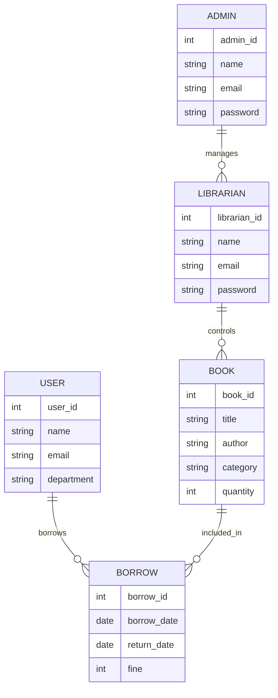

# Software Requirements Specification (SRS)

# SmartLibrary – Library Management System

---

# Preface

This document provides the Software Requirements Specification (SRS) for the SmartLibrary System. It defines the functionalities, performance criteria, security requirements, and overall system architecture required for development.

---

# Version History

- Version 1.0 – Initial Draft
- Version 1.1 – Added non-functional requirements
- Version 1.2 – Added ER Diagram and system evolution

---

# 1. Introduction

## Purpose

The SmartLibrary System is a web-based application designed to automate and manage library operations efficiently. The system helps librarians manage books, students, borrowing activities, fines, and reports digitally.

---

## Document Conventions

This document follows IEEE SRS standards using:

- **Must** – Mandatory requirements
- **Should** – Recommended requirements
- **May** – Optional enhancements

---

## Intended Audience and Reading Suggestions

- **Developers** – For implementation guidance
- **Project Managers** – For project planning
- **Stakeholders** – For understanding system features
- **Testers** – For requirement validation

---

## Scope

The system provides:

- Book management
- Student/member management
- Borrow and return tracking
- Fine calculation
- Search functionality
- Report generation
- Role-based access control

---

## References

- IEEE Standard 830-1998
- Software Engineering Documentation
- Internal Requirement Analysis

---

# 2. Overall Description

## Product Perspective

The SmartLibrary System is a standalone web application that can be integrated with barcode scanners and online notification systems.

---

## Product Functions

### Book Management
- Add, update, delete, and search books

### User Management
- Manage students and librarians

### Borrowing System
- Borrow and return books

### Fine Management
- Calculate overdue fines automatically

### Reporting
- Generate borrowing and fine reports

### Notifications
- Notify users about due dates and fines

---

## User Classes and Characteristics

### Admin
- Manages the whole system
- Controls users and settings

### Librarian
- Manages books and borrowing operations

### Student/User
- Searches and borrows books

---

## Operating Environment

- Web-based application
- Supports Chrome, Firefox, Edge
- Database: MySQL
- Cloud-hosted server

---

## Design and Implementation Constraints

- Must support secure login
- Must maintain data integrity
- Must support multiple users simultaneously

---

## Assumptions and Dependencies

- Internet connection is required
- Users have valid accounts
- Database server remains operational

---

# 3. System Requirements Specification

# Functional Requirements

---

## User Authentication

- The system must allow users to register and log in.
- The system must support password reset.
- The system must implement role-based access.

---

## Book Management

- Librarians must be able to add books.
- Librarians must be able to update book details.
- Users must be able to search books.

---

## Borrowing System

- Users must be able to borrow books.
- The system must track return dates.
- The system must update availability automatically.

---

## Fine Management

- The system must calculate overdue fines.
- Users must be notified about fines.

---

## Reporting

- Admins must be able to generate reports.
- Reports should be exportable in PDF format.

---

## Notifications

- The system must notify users about due dates.
- The system should send reminders for overdue books.

---

# Non-Functional Requirements

---

## Performance Requirements

- The system must support 300+ concurrent users.
- Search results should appear within 2 seconds.

---

## Security Requirements

- Passwords must be encrypted.
- The system must implement role-based access control.

---

## Usability Requirements

- The UI should be user-friendly.
- The system should support accessibility standards.

---

## Reliability and Availability

- The system must ensure 99% uptime.
- Backup systems must be available.

---

## Maintainability

- The system must support modular updates.
- Proper logging mechanisms should be implemented.

---

## Portability

- The system should run on Windows, Linux, and Mac.
- The system should support cloud deployment.

---

# 4. System Models

# ENTITY-RELATIONSHIP DIAGRAM

## ER Diagram Image

---

## ER Diagram Code

---

# 5. System Evolution

## Assumptions

- Mobile application support may be added in the future.
- AI-based book recommendation may be integrated.

---

## Expected Changes

- Online payment integration for fines
- QR code-based borrowing system
- Cloud synchronization

---

# 6. Appendices

## Hardware Requirements

- Cloud server with scalable infrastructure
- Minimum 8GB RAM server

---

## Database Requirements

- MySQL relational database
- Proper indexing and relationships required

---

# Conclusion

The SmartLibrary System aims to modernize library management by automating borrowing operations, improving efficiency, and ensuring secure access to library resources.
