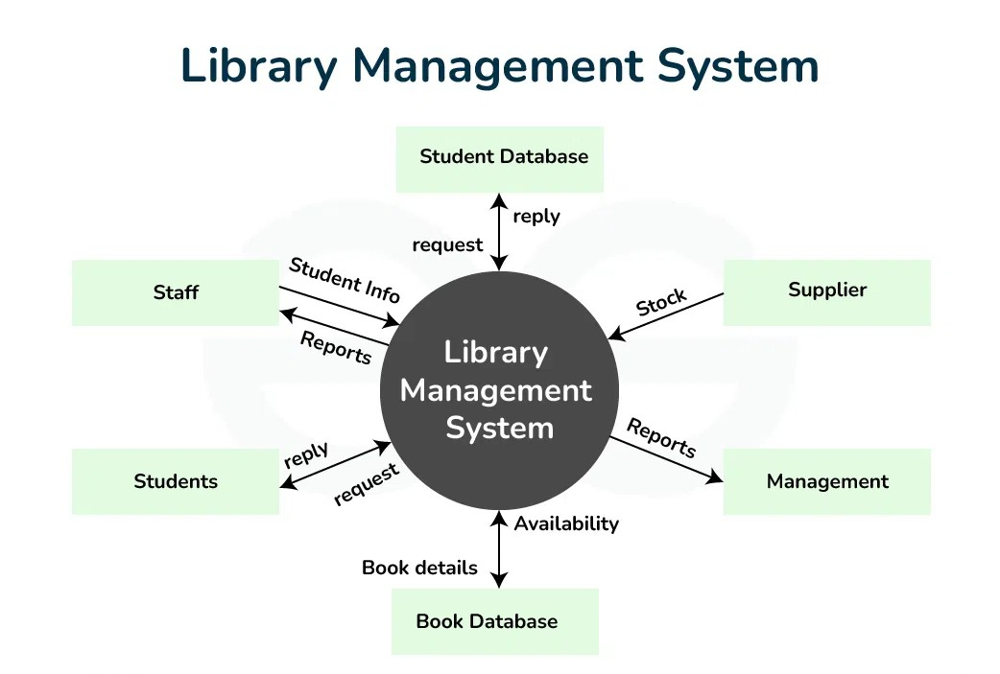
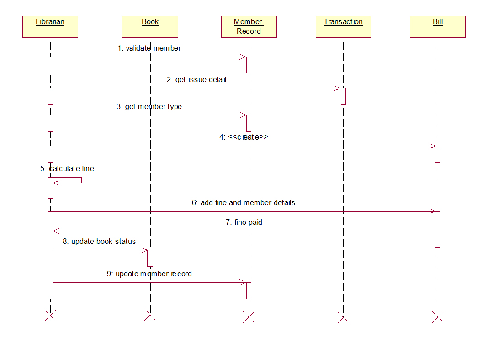

# Library Management System

## Software Requirements Specification (SRS)

---

# Preface

This document provides the **Software Requirements Specification (SRS)** for the **Library Management System**. It defines the system functionalities, performance criteria, security requirements, and overall system architecture necessary for system development and deployment.

---

# Version History

| Version | Description |
|--------|-------------|
| Version 1.0 | Initial Draft |
| Version 1.1 | Added Non-Functional Requirements and System Models |
| Version 1.2 | Refined System Evolution and Glossary |

---

# 1. Introduction

## Purpose

The **Library Management System** is a web-based application designed to automate and simplify library operations such as:

- Book management
- Borrowing and returning
- User management
- Fine tracking
- Reporting and analytics

The system enables librarians and users to efficiently manage books, maintain borrowing records, and improve overall library productivity through a secure and user-friendly digital platform.

---

## Document Conventions

This document follows the **IEEE SRS Standard** using:

- **Must** – Indicates mandatory requirements
- **Should** – Indicates recommended features
- **May** – Indicates optional enhancements

---

## Intended Audience and Reading Suggestions

### Project Managers & Developers

For system implementation guidance and architectural understanding.

### Stakeholders & Business Analysts

To understand system capabilities and project scope.

### Testers & QA Teams

To validate compliance with specified requirements.

---

## Scope

The system provides:

- User authentication and authorization
- Book management and inventory tracking
- Borrowing and returning management
- Fine calculation and tracking
- Search and filtering functionality
- Report generation and monitoring
- Role-based access and security features

---

## References

- IEEE Standard 830-1998 (Software Requirements Specification)
- Internal Business Requirement Specification (BRS)
- System Modeling Documentation

---

# 2. Overall Description

## Product Perspective

The Library Management System is a standalone web application that digitizes traditional library operations. The system may integrate with external services such as cloud databases and notification systems for enhanced functionality.

---

## Product Functions

### Book Management

- Add books
- Update book information
- Remove books
- Monitor inventory

### Borrow & Return Management

- Issue books
- Return books
- Track overdue records

### User Management

- Manage users and librarians
- Control access permissions

### Reporting & Analytics

- Generate borrowing reports
- Track fines and inventory

### Notifications

- Send due-date reminders
- Send overdue alerts
- Notify system updates

---

## User Classes and Characteristics

### Admin

- Manages users
- Controls permissions
- Generates reports
- Maintains system settings

### Librarian

- Handles book inventory
- Issues and receives books
- Tracks borrowing records

### User / Student

- Searches books
- Borrows books
- Views borrowing history

---

## Operating Environment

- Web-based application
- Supported Browsers:
  - Google Chrome
  - Mozilla Firefox
  - Microsoft Edge
- Database: MongoDB
- Cloud-hosted infrastructure

---

## Design and Implementation Constraints

- Compliance with security and data protection standards
- Responsive design for multiple devices
- Scalable architecture for future expansion

---

## Assumptions and Dependencies

- Internet connection is required
- Cloud database services must remain operational
- Future mobile application integration may be considered

---

# 3. System Requirements Specification

## Functional Requirements

### User Authentication

- Users must be able to register and log in securely
- The system must support password recovery
- The system must implement role-based authentication

### Book Management

- Librarians must be able to add books
- Librarians must be able to update book information
- Librarians must be able to remove books
- The system must track book availability

### Borrow & Return Management

- Users must be able to borrow available books
- Users must be able to return borrowed books
- Inventory must update automatically
- The system must calculate overdue fines automatically

### Search Functionality

- Users must be able to search books by title
- Users should be able to search by author and category
- The system should display book availability status

### Reporting & Analytics

- Admins and librarians must generate reports
- Reports should include:
  - Overdue books
  - Fine summaries
  - Inventory summaries
- Reports should support:
  - PDF export
  - CSV export

### Notifications

- Due-date reminders
- Overdue alerts
- System update notifications

---

## Non-Functional Requirements

### Performance Requirements

- Support at least 500 concurrent users
- Search results within 2 seconds
- Real-time inventory updates

### Security Requirements

- Role-based access control
- Data encryption
- HTTPS secure communication

### Usability Requirements

- Intuitive user interface
- Responsive design
- Accessibility support

### Reliability and Availability

- 99.9% uptime
- Backup and recovery support

### Maintainability and Support

- Modular architecture
- Logging and debugging mechanisms

### Portability

- Support for:
  - Windows
  - macOS
  - Linux
- Cloud deployment compatibility

---

# 4. System Models

## Context Diagram

---

## Activity Diagram

---

## Use Case Diagram

---

## Sequence Diagram

---

## Entity Relationship Diagram (ERD)

---

## State Diagram

---

# 5. System Evolution

## Assumptions

- Mobile platform support may be added
- AI-based recommendations may improve usability
- Scalability for large institutional libraries should be supported

---

## Expected Changes

- Barcode and QR code integration
- Email and SMS notification support
- Online reservation and renewal system
- Advanced analytics dashboard

---

# 6. Appendices

## Hardware Requirements

- Cloud-based scalable servers
- Minimum 8GB RAM recommended

---

## Database Requirements

The database must maintain logical relationships among:

- Users
- Books
- Borrow Records
- Categories
- Fine Records

---
